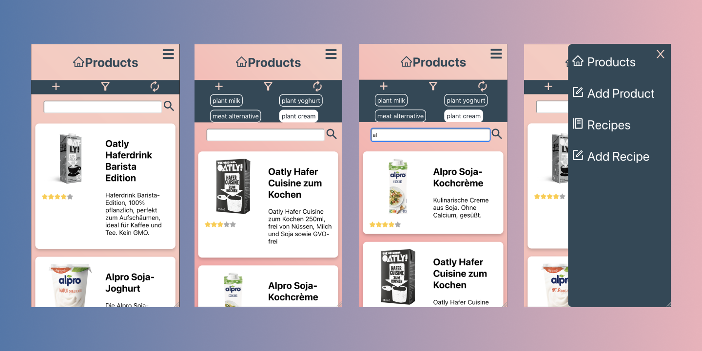
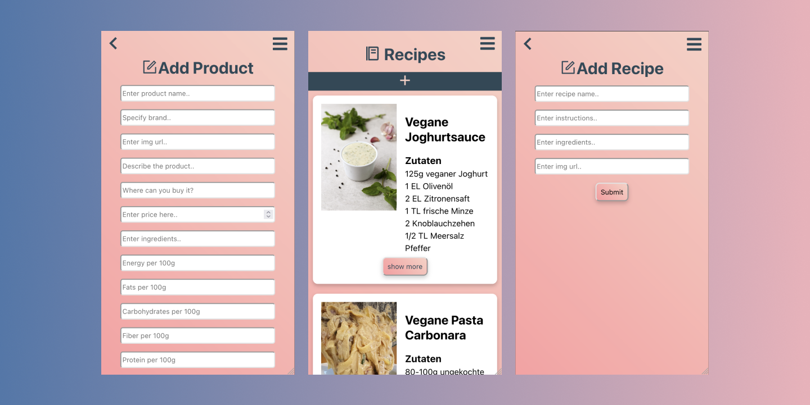

# Capstone project

This app is a database for all the foods you have tried or want to try.

## Description

This is my capstone project for neuefische web development bootcamp.

Have you ever stood in front of a product at your local grocery store and asked yourself if you've tried that product before and if you did, whether you actually liked it?
This is where this app comes in: save your favorite (and least favorite) food products with a rating along with some recipes, so the next time you ask yourself whether you actually liked that product, you know where to find the answer.

## Demo

The app is currently deployed with vercel. Click this link if you want to try it out: http://capstone-project-azure.vercel.app/.

## Tech Stack

- React
- React Router
- React Custom Hooks
- Styled-Components
- React Testing Library / Jest
- localStorage
- Storybook
- npm
- Vercel
- lodash.debounce

## Project Setup

- Clone this repository
- Install all the dependencies via `$ npm install`
- Run the app on your local machine using `$ npm run start`
- Run tests via `$ npm run test`
- Run Storybook via `$ npm run storybook`
